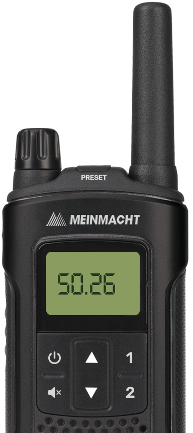

### Introduction
ac_radio is a framework-standalone user interface for radio control. The only dependencies are [pma-voice](https://github.com/AvarianKnight/pma-voice) and [ox_lib](https://github.com/overextended/ox_lib).

You can use any supported framework to enable additional features such as usable item or restrictions.  
Supported frameworks are [ox_core](https://github.com/overextended/ox_core), [qbx_core](https://github.com/Qbox-project/qbx_core), [qb-core](https://github.com/qbcore-framework/qb-core) and [es_extended](https://github.com/esx-framework/esx_core).

Report bugs using [GitHub issues](https://github.com/acscripts/ac_radio/issues). Use the official [Discord server](https://discord.gg/2ZezMw2xvR) for support.

### Features
- Two available channel presents customisable by player
- Channel frequency restrictions for groups/jobs
- Usable item for [ox_inventory](https://github.com/overextended/ox_inventory) and any ESX / QB inventory
- Variable frequency limit and step between them
- Tooltips for individual buttons on the radio
- Buttons for complete volume control (up, down, mute)
- Choose between command and usable item
- Support for custom locales

### Documentation
https://docs.acscripts.dev/radio

### Preview
https://youtu.be/9zxbDJMhVSw

